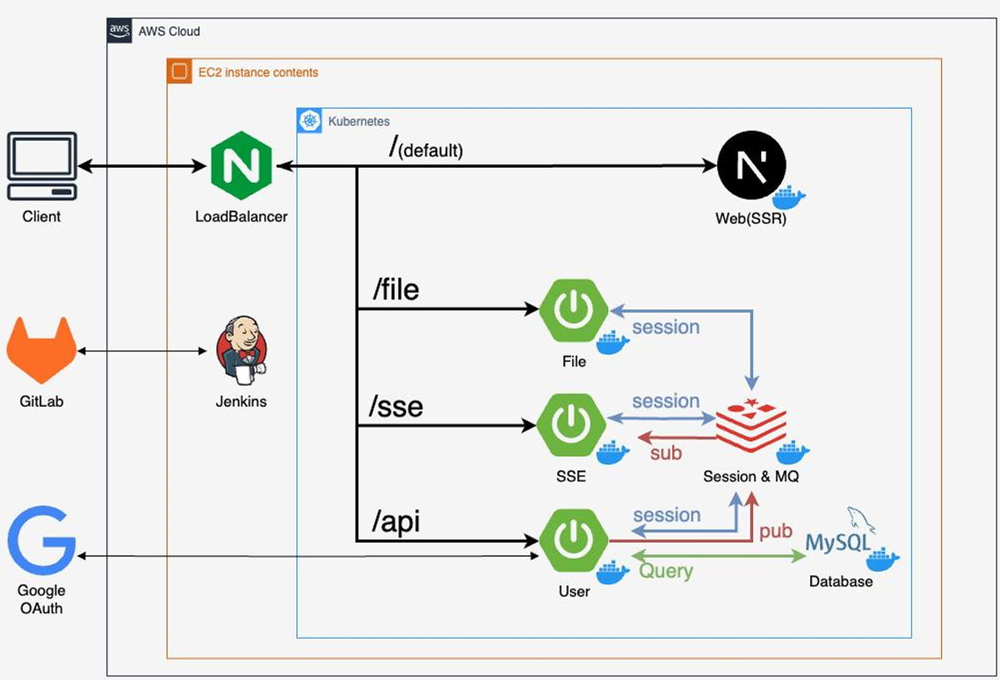
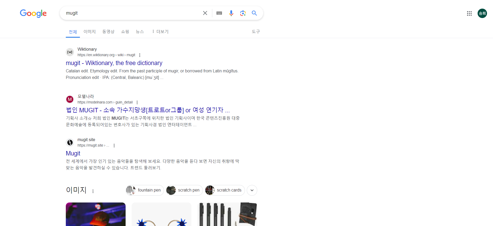
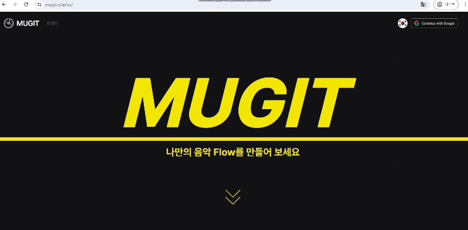
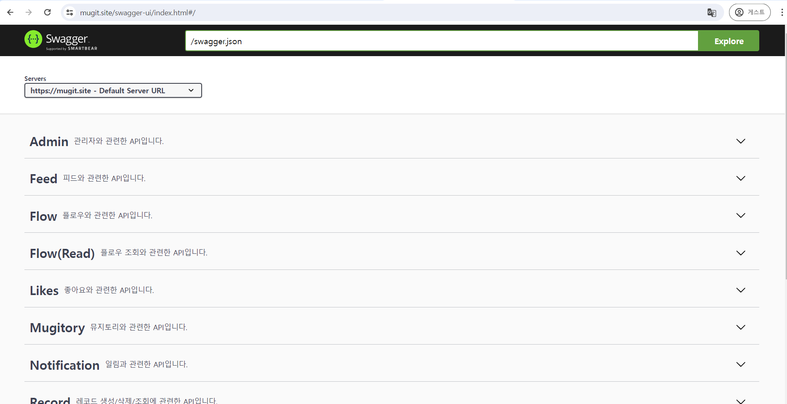

# :musical_score:Mugit

## 목차

- [1. 프로젝트 주제](#1-프로젝트-주제)
- [2. 프로젝트 기간](#2-calendar-프로젝트-기간)
- [3. 페르소나 분석](#3-thinking-페르소나-분석)
- [4. 프로젝트 기획](#4-bulb-프로젝트-기획)
- [5. 기능 설명](#5-wrench-기능-설명)
- [6. 프로젝트 설계](#6-memo-프로젝트-설계)
- [7. 주요 페이지](#7-desktop_computer-주요-페이지)

## 1. :book: 프로젝트 주제

GIT 처럼 음악 관리, 협업할 수 있는 플랫폼

## 2. :calendar: 프로젝트 기간

2024년 4월 10일 ~ 2024년 5월 20일 (7주)

## 3. :thinking: 페르소나 분석

- 음악을 좋아하는 사람
- 오픈소스 음원이 필요한 사람
- 음악을 작곡하는 과정에서 음악적 영감이 필요한 사람
- 협업을 통해 음악을 작곡해야 하는 사람

## 4. :bulb: 프로젝트 기획

### :seedling: 기획의도

- 자신의 창작물 프로젝트를 저장해서 관리할 수도 있고 다른 사람과도 쉽게 협업할 수 있도록 한다.

## :star2: 차별점

- 오픈소스 음원 제공
- 음악의 변화 과정을 한눈에 볼 수 있는 그래프
- 음원 파일 저장에 최적화된 파일관리 시스템

## 5. :wrench: 기능 설명

### :speech_balloon: 용어 설명

- Trends : 다른 사용자의 플로우를 듣고, 직접 참여할 수 있는 페이지

- Note : 해당 곡의 시작점

- Flow : 생성된 곡이 여러 유저에 의해 변경되는 지점

- Record : 각 음악이 가진 소스(오픈소스)

- Release : 음악이 완성되었을 때 음반 발매`

#### 1) 다국어

- 언어 설정 기능

#### 2) 로그인

- Google 소셜 로그인

#### 3) 트렌드

- 특정 해시태그로 플로우 검색 기능
- 검색창을 통한 플로우 검색 기능
- 트렌트 둘러보기 페이지 Infinite Scroll 기능
- 트렌드 검색시 검색 결과 Pagination

#### 4) 플로우 재생

- 트렌드 페이지에서 노래 재생 클릭시 하단 재생바에서 flow 재생 기능

#### 6) 플로우 상세 페이지

- 플로우를 구성하고 있는 source들 확인

- 플로우 좋아요 기능

- 플로우의 흐름을 나타내는 graph

- 댓글 작성

- 댓글에 음악 시간 클릭시 해당 시간으로 flow 재생바 이동

- 마음에 드는 Flow 발견시 Works 탭에 저장 가능

#### 7) Record 페이지

- Flow에서 기존 비트 삭제 및 준비된 소스 추가 후 릴리즈 및 재생 가능

- 음악 Editor 기능

#### 8) 알림

- 릴리즈 한 플로우에 다른 팀원이 좋아요 및 댓글 후 알림 확인 / 읽기 처리

#### 9) 프로필

- 본인 페이지로 이동해서 팔로우 및 플로우 조회

- 플로우 그래프 조회

- 뮤지토리에서 릴리즈한 플로우 레코드 확인

### :mag_right: 세부 구현

#### 1) 메시지 / 국제화

- 페이지를 구성하는 메시지들을 별도 설정파일로 분리해서 관리
- 변경사항이 발생하면 해당 설정파일을 변경하는 것으로 쉽고 유연한 확장 가능
- 국가 언어별 설정 파일도 경로에 맞게 변경되도록 하며, 브라우저에서 자동으로 해당 국가에 맞는 코드 식별

#### 2) 알림기능

- SSE의 개념에 대한 소개, 한계점(Connection 지속, scale out 어려움) 설명
- 이를 해결하기 위한 알림서버 분리 및 레디스 메시지 큐 도입
- 불필요한 Connection은 알림서버가 처리하여 메인 서버의 성능문제 해결
- 서비스 및 서버가 추가되어도 해당 서버를 통해 알림 전송가능

#### 3) 플로우 그래프 탐색

- 플로우를 부모와 자식관계로 구성하여 DB에 저장(본인참조)
- 플로우 그래프 조회 시, 루트(노트) 플로우부터 전위순회 DFS를 통해 전체 그래프 조회
- 해당 그래프를 하이버네이트 속성인 batch_fetch_size를 통해 한번의 쿼리로 모두 조회 가능(N+1문제 해결)

#### 4) 파일 시스템 관리

- 각 플로우를 추가할 때마다 음원과 이미지 파일을 저장해야 하므로, 저장공간 최적화 필요
- 플로우 생성시 자식 플로우는 부모의 특정 파일을 복제하지 않고 파일 경로만 별도로 저장
- 스케줄러에 새벽 4시마다 작업을 등록하여, DB에서 어떤 플로우도 참조하지 않는 음원과 이미지 파일을 검색 후 해당 파일을 삭제

[맨위로](#mugit)

## 6. :memo: 프로젝트 설계

### :building_construction:시스템 아키텍쳐

### :books: 기술 스택

  <h2>Languages</h2>
  
  
  <h2>MarkUp</h2>
  
  
    
<h2>Databases</h2>
  
  
  <h2>Frameworks</h2>
  
  
  
  
  <h2>Infrastructure</h2>
  
  
  
  
  
  <h2>Utility</h2>
  
  <h2>SCM</h2>
  
  

 

## :busts_in_silhouette: 역할 분담

| 성명         | 주 역할 | 기능                                                                                   | 주요 서버            |
| ------------ | ------- | -------------------------------------------------------------------------------------- | -------------------- |
| 배성준(팀장) | BE      | 인프라 구축, CI / CD 관리, Flow 관련 API                                               | 메인 서버            |
| 남상엽       | BE      | User 관련 API, 인증 및 보안, SSE 통신을 이용한 알림                                    | 메인 서버, SSE 서버  |
| 이준학       | BE      | Record 관련 API, 음악/사진 파일 관리, 파일 정리 자동화                                 | 메인 서버, 파일 서버 |
| 이연우       | FE      | user profile page, flow detail page, SSE알림, google 소셜 로그인                       | frontend 서버        |
| 김승희       | FE      | landing page, trends page, trends 검색, flow graph, music editor 기능, 하단 뮤직재생바 | frontend 서버        |
| 김도희       | FE      | Record page                                                                            | frontend 서버        |

[맨위로](#mugit)

## 7. :desktop_computer: 주요 페이지

|                                                                   google 검색 가능                                                                   |
| :--------------------------------------------------------------------------------------------------------------------------------------------------: |
|                                                                          |
| Next.js를 활용하여 구축한 프로젝트를 Google 검색 엔진에 최적화하고, Google Search Console을 통해 관리하여 SEO(검색 엔진 최적화) 성능을 극대화하였다. |

|                                       Landing Page                                       |
| :--------------------------------------------------------------------------------------: |
|  |
|                   i18n 라이브러리를 이용하여 국제화 기능을 구현하였다.                   |

|                                                Trend                                                 |
| :--------------------------------------------------------------------------------------------------: |
|  |
|                  |
|                           infinite scroll과 pagination을  직접 구현하였다.                           |

|                                  Feed                                   |
| :---------------------------------------------------------------------: |
|  |
|            follow한 user들이 작업한 flow들을 확인할 수 있다.            |

|                                                                                                               Flow Detail                                                                                                               |
| :-------------------------------------------------------------------------------------------------------------------------------------------------------------------------------------------------------------------------------------: |
|                                                                                                                                           |
|                                                                                                                                                       |
|                                                                                                                                                         |
| - 플로우를 구성하고 있는 source들 확인  - 플로우 좋아요 기능  - 플로우의 흐름을 나타내는 graph  - 댓글 작성 - 댓글에 음악 시간 클릭시 해당 시간으로 flow 재생바 이동 - 마음에 드는 Flow 발견시 Works 탭에 저장 가능 |

|                                                         Profile                                                         |
| :---------------------------------------------------------------------------------------------------------------------: |
|                                 |
|                                          |
| - 본인 페이지로 이동해서 팔로우 및 플로우 조회  - 플로우 그래프 조회 - 뮤지토리에서 릴리즈한 플로우 레코드 확인 |

|                                  New Note, Music Editor                                   |
| :---------------------------------------------------------------------------------------: |
|  |
|       |
|                - 새로운 루트가 되는 Note 생성 기능 - 음악 Editor 기능                 |

### :green_heart: 서버

#### [해당 경로](https://mugit.site/swagger)에서 확인이 가능합니다.

[맨위로](#mugit)
